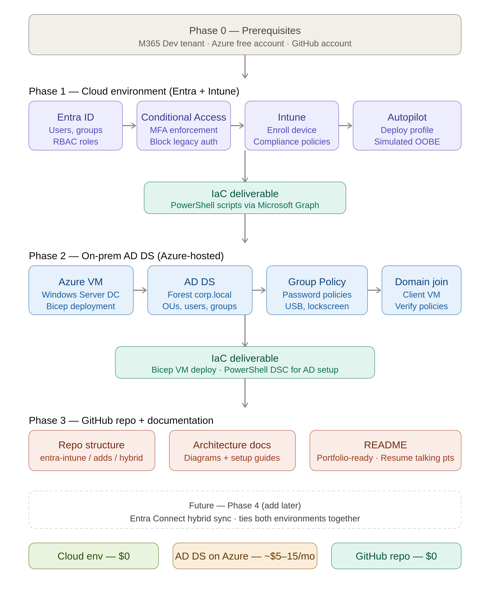

## Business problem

A growing company needs centralized identity, secure access controls, and consistent Windows endpoint management without maintaining a large on-premises management platform.

This ongoing project combines Microsoft Entra ID, Conditional Access, Intune, Windows Autopilot, and an Azure-hosted Active Directory environment. The goal is to make the design reproducible through PowerShell, Microsoft Graph, Bicep, and clear documentation.

## Requirements

- Centralize users and groups.
- Enforce multifactor authentication and risk-based access controls.
- Enrol and configure Windows endpoints.
- Separate administrative privileges from standard user access.
- Document the design so another administrator can reproduce it.

## Architecture



The design is divided into three layers:

- **Cloud identity and endpoint management:** Entra ID, Conditional Access, MFA, Intune, Autopilot, users, groups, and role assignments.
- **Azure-hosted AD DS:** Windows Server, DNS, Group Policy, delegated administration, and a domain-joined client.
- **Automation and documentation:** PowerShell, Microsoft Graph, Azure CLI, Bicep, setup guides, diagrams, and validation evidence.

The cloud and AD DS environments remain separate during the current build. Entra Connect and hybrid synchronization are planned only after both environments are stable.

## Implementation

### Phase 1 — Project foundation

The repository is organized by environment so scripts, diagrams, setup guides, and design decisions are easy to locate.

```text
entra-intune/
adds/
hybrid/
public/images/projects/
```

Each feature is configured manually first, validated, and then automated. This prevents the project from becoming a collection of scripts that were never tested against a working design.

### Phase 2 — Entra identity baseline

Test users are being created across HR, IT, and Finance. Security groups represent departmental access, while administrative roles are assigned only to dedicated privileged accounts.

Microsoft Graph PowerShell is used for:

- User creation
- Group creation and membership
- Role assignment
- Existing-object checks

The scripts are being designed to be idempotent so rerunning them does not create duplicates.

### Phase 3 — Conditional Access and MFA

The initial policy set includes:

1. Blocking legacy authentication.
2. Requiring MFA outside trusted locations.

Policies start in **Report-only** mode. Sign-in logs are reviewed before enforcement to avoid accidental lockout.

Risk-based controls are part of the target design, but they will only be marked complete after licensing and test evidence are confirmed.

### Phase 4 — Intune and Autopilot

The endpoint phase includes:

- Windows enrolment
- Compliance checks for BitLocker, Firewall, and OS version
- Configuration profiles for lock-screen timeout and USB restrictions
- Required application deployment
- Windows Autopilot profile assignment

A full Autopilot reset may remain outside the immediate test scope if it risks disrupting the primary physical device. The expected deployment flow will still be documented.

### Phase 5 — Azure-hosted AD DS

The AD DS environment is planned through Bicep and PowerShell with:

- A Windows Server VM
- Static private addressing
- Restricted RDP access
- AD DS and DNS
- Departmental OUs
- Test users and groups
- Delegated password-reset rights
- Group Policy
- A domain-joined Windows client

## Security decisions

### Administrative account separation

Standard user accounts are not used for privileged administration. Dedicated admin identities reduce exposure during normal browsing, email use, and daily work.

### Least privilege

Roles are assigned by task. Global Reader and Helpdesk Administrator are used where possible instead of broad tenant-wide privileges.

### Emergency access accounts

The design includes cloud-only emergency access accounts for tenant recovery. These accounts are protected, monitored, and not used for daily administration.

### Conditional Access exclusions

Emergency access accounts are excluded from policies that could cause a tenant-wide lockout. Temporary exclusions may also be used for testing, but only for specific accounts and only for as long as required.

## Problems and troubleshooting

### Microsoft 365 admin sign-in failure

**Symptom:** The Microsoft 365 admin portal rejected a personal Outlook or Hotmail account.

**Root cause:** The portal requires a work or school account from the tenant.

**Fix:** The tenant-specific `onmicrosoft.com` administrator account was used instead.

### Licensing and feature availability

**Symptom:** Entra ID P2 or Intune features may not appear as expected.

**Diagnostic path:**

- Check the Microsoft 365 subscription state.
- Verify assigned licences.
- Confirm access to the Entra and Intune portals.
- Confirm that the developer subscription has not expired.

**Current limitation:** Risk-based Conditional Access and some Intune features will not be claimed as complete until licensing is verified.

### Automation reliability

A script that works once but creates duplicates on the second run is not reliable automation. Each script therefore checks for existing users, groups, policies, and assignments before creating new objects.

## Outcome

This project is still in progress.

The architecture, security model, build phases, repository structure, and automation approach are defined. The intended end state includes centralized identities, controlled admin roles, Conditional Access, managed Windows endpoints, Autopilot, Azure-hosted AD DS, Group Policy, and repeatable deployment scripts.

Completion will be supported by evidence such as:

- Microsoft Graph output for users and groups
- Entra role assignments
- Conditional Access results in sign-in logs
- Intune compliance and policy status
- Application deployment results
- Domain-join validation
- `gpresult` output
- Delegated administration tests
- A successful rebuild from the repository

Hybrid synchronization, high availability, SIEM integration, certificate services, and disaster recovery remain outside the current scope.

## Lessons learned

For production, I would:

- Use a routable AD DNS subdomain instead of `corp.local`.
- Deploy at least two domain controllers.
- Use Privileged Identity Management.
- Store secrets in a managed vault.
- Use deployment rings for Intune and Conditional Access.
- Add centralized monitoring and alerting.
- Test emergency access accounts on a schedule.
- Add rollback and formal change control before enforcing policies.
- Introduce Entra Connect only after both environments are stable.